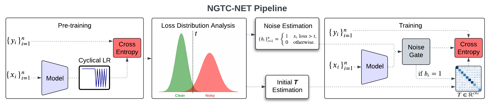

# NGTC-NET: Noise Gate Transition Correction for Learning with Label Noise

Yuval Grinberg, Nimrod Harel, Jacob Goldberger, Ofir Lindenbaum

## PyTorch implementation

### Dependencies

we implement our methods by PyTorch on NVIDIA Tesla GPU. The environment is as bellow:

- [PyTorch](https://PyTorch.org/), version >= 2.2.0
- [CUDA](https://developer.nvidia.com/cuda-downloads), version >= 0.17.0

### Install PyTorch and Torchvision (Pip3):

pip3 install torch torchvision

### Experiments

We verify the effectiveness of NGTC-NET on three synthetic noisy datasets (MNIST, CIFAR-10, CIFAR-100), and one real-world dataset with synthetic noise (Azimuth's scRNA PBMC cell-type annotation).

### To run the code:

python3 main.py --dataset &lt;-dataset-&gt;  --noise_type  &lt;-noise type-&gt; --noise_rate &lt;-noise rate-&gt; --save_dir &lt;-path of the directory-&gt;

Here is an example: 

python3 main.py --dataset cifar10 --noise_type symmetric --noise_rate 0.2 --save_dir tmp

The statistics will be saved in the specified directory (tmp in this example). 
